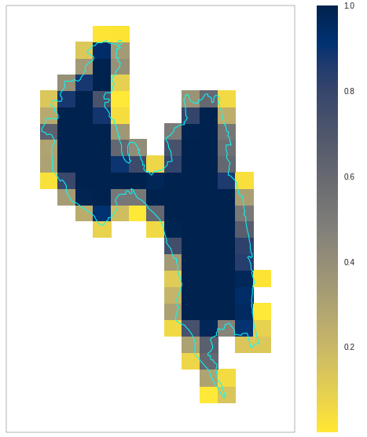

# pyscissor
A Python3 module for extracting data from netcdf file under a shapefile region. 




### Installation

pyscissor can be installed using the following commands

```bash
$ git clone https://github.com/nzahasan/pyscissor.git
$ cd pyscissor
$ python3 setup.py install
```
or using pip

```bash
$ pip install https://github.com/nzahasan/pyscissor/zipball/master
```

### Using pyscissor

```python
import numpy as np
from pyscissor import scissor 

'''<code for reading netcdf and shapefile>'''

pys = scissor(polygon,lats,lons)

weight_grid = pys.get_masked_weight()

# assign mas to variable
var.mask = weight_grid.mask 


# get weighted average
avg = np.average(var,weights=weight_grid)

```
A detailed use case can be found <a href="notebooks/example_01.ipynb">here</a>


### Using nc2ts.py
this module contains `nc2ts.py` script. This can be used to extract reduced(min/max/average/weighted average) timeseries form netcdf file

```bash
# with 4d array [data/sample_1.nc]
$ nc2ts.py -n=sample_1.nc -ni='Y=lat;X=lon;T=time;V=temperature;slicer=[:,0,:,:]' -s=shape_esri.zip \
		-sp='ADM2_EN;ADM3_EN' -r=wavg -o=test1.csv

# with 3d array [data/sample_2.nc] normal case
$ nc2ts.py -n=sample_2.nc -ni='Y=lat;X=lon;T=time;V=tmin;' -s=shape_esri.zip \
		-sp='ADM2_EN;ADM3_EN' -r=avg -o=test2.csv
```
Options:

	-n = netcdf file

	-ni = netcdf information
		provide X = x dimension,Y= y dimension,T = time dimesion, V=variable name,
		idx = slicing index for obtaining 3d array 
				(only requires if variable has greather than three dimension)

	-s  = shape file ( canbe zipped shapefile, shapefile or geojson )

	-sp = shapefile properties
		only required when shapefile contains multiple records

	-r  = reducer, default is average
		Available options: min,max,avg,wavg

	-o  = output file
